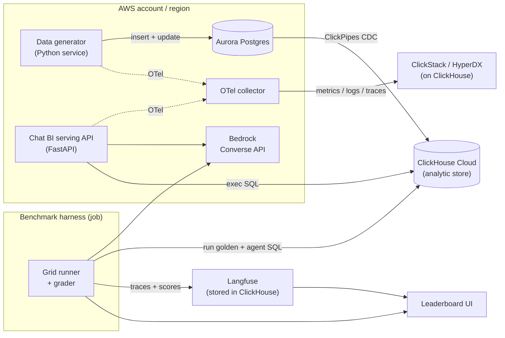

# ChatBI Arena — Design Document

**Working title:** ChatBI Arena (rename freely; the `*House` convention would give you something like `ArenaHouse` or `BenchHouse`)
**Status:** Design — ready for implementation
**Audience:** Claude Code (implementation), plus reviewers
**Owner:** Si Shuo (ClickHouse PSE, APJ)

---

## 1. Summary

ChatBI Arena is a **benchmark harness for natural-language-to-SQL agents** over a live ClickHouse Cloud dataset that is continuously fed from AWS Aurora via ClickPipes CDC. It runs **many agent configurations** — a grid of `{Bedrock model} × {prompt strategy}` — against a **ground-truthed golden question set**, grades each answer by **execution accuracy** (result-set comparison, not SQL text), and tracks **cost, latency, and error rate** per configuration via Langfuse. Application and serving telemetry flow to ClickStack (HyperDX on ClickHouse) so the same engine holds the business data, the operational telemetry, and the AI's behavior.

The deliverable is **not "a chatbot that answers questions."** It is a measurement rig that answers, with evidence: *which model and prompt should we put in production for this workload, and what does correctness cost?* The headline output is a leaderboard keyed on **cost per correct answer**.

### The story this serves
Stop trusting GenAI demos; start measuring agents. Picking a model and prompt for NL2SQL is treated as a one-time guess. This rig makes it an evidence-based, repeatable decision — and it is the offline precursor to a self-optimizing router (see §11).

---

## 2. Goals and non-goals

### Goals
1. Continuously generate realistic e-commerce OLTP data into Aurora Postgres, including **updates** (status transitions, returns), not just inserts.
2. Sync that data to ClickHouse Cloud via **ClickPipes Postgres CDC**, exposed through stable analytic views.
3. Run a **grid of agent configs** (models × prompts) as a Chat BI (NL → ClickHouse SQL → result).
4. Grade answers rigorously via **execution accuracy** against a tiered golden question set.
5. Track **correctness, cost (USD), latency, retries, and error type** per config in **Langfuse**, using its Datasets/Experiments primitives.
6. Emit app + serving telemetry to **ClickStack** via OpenTelemetry; surface ClickPipes replication lag.
7. Produce a **leaderboard** (model × prompt → accuracy, cost-per-correct-answer, latency, by difficulty tier) and a small **live Chat BI surface** for the on-stage demo.

### Non-goals
- Not building a production query gateway or auth system.
- Not a general-purpose semantic layer.
- Not fine-tuning models.
- Not (in v1) live auto-routing — that is the documented phase-2 stretch (§11).

---

## 3. High-level architecture



### Component inventory
| # | Component | Responsibility | Suggested tech |
|---|-----------|----------------|----------------|
| C1 | Data generator | Continuous synthetic OLTP load into Aurora | Python (Faker), containerized |
| C2 | Aurora Postgres | OLTP source of truth | Aurora PostgreSQL |
| C3 | ClickPipes CDC | Aurora → ClickHouse replication | ClickPipes (managed) |
| C4 | ClickHouse Cloud | Analytic store the agents query | ClickHouse Cloud |
| C5 | Agent core | NL → SQL → result loop, per config | Python + boto3 (Bedrock) + clickhouse-connect |
| C6 | Benchmark harness | Run the grid, grade, score | Python + Langfuse SDK |
| C7 | Golden set | Questions + golden SQL + expected results | YAML in repo |
| C8 | Langfuse | Tracing + dataset/experiment + scores | Langfuse (Cloud or self-hosted on CH) |
| C9 | ClickStack/OTel | App + serving observability | OTel collector + HyperDX |
| C10 | Leaderboard | Results visualization | FastAPI + static page, or query Langfuse |
| C11 | Serving API | Live Chat BI endpoint for the demo | FastAPI |

---

## 4. Technology decisions

### Decided (implement as stated unless a blocker appears)
- **Aurora Postgres** over MySQL. Cleaner logical-replication story and the most mature ClickPipes CDC path. (If the audience specifically needs MySQL, the binlog path works too, but default to Postgres.)
- **Python everywhere** (data-gen, agents, harness). Best SDK coverage for Bedrock (`boto3`), Langfuse, ClickHouse (`clickhouse-connect`), OpenTelemetry.
- **Bedrock Converse API** as the single model interface. It returns token `usage`, which feeds cost.
- **Agents query ClickHouse only.** Aurora is upstream CDC source, not a query target. Golden SQL is ClickHouse dialect.
- **Stable analytic views** (`v_*`) over the CDC-landed tables, applying `FINAL` (see §6.2). Agents and golden SQL both target the views.
- **Config-driven model/prompt grid and pricing** (`config.yaml`), so adding a model is a config edit, not a code change.

### To confirm before/early in implementation (flag, don't block)
1. **Langfuse hosting:** Langfuse Cloud (fastest) vs self-hosted on ClickHouse Cloud (best "all on ClickHouse" story for the demo). Default: start on Cloud, migrate to self-hosted if the narrative needs it.
2. **Bedrock model list:** depends on what is enabled in the target account/region. Pick at least one cheap and one strong model per family. Verify region availability first.
3. **Compute for live components:** ECS Fargate for data-gen + serving API (demo-grade), or local/docker-compose if running the whole thing from one box. Harness can run as a one-shot job.
4. **Leaderboard surface:** lightweight FastAPI + static HTML reading from a results table, vs reading directly from Langfuse. Default: write a flat `eval_runs` results table in ClickHouse and render from it (decouples the UI from Langfuse internals).

---

## 5. Component spec — Data generator (C1)

### Domain
E-commerce. Chosen because it yields rich analytical questions (aggregations, joins, time-series, funnels, retention) and a believable continuous OLTP → OLAP shape.

### Aurora source schema (DDL)
```sql
CREATE TABLE customers (
  customer_id  BIGINT PRIMARY KEY,
  full_name    TEXT NOT NULL,
  email        TEXT NOT NULL,
  country      TEXT NOT NULL,   -- ISO-ish: 'SG','VN','TH','ID','AU','IN','TW','JP'
  segment      TEXT NOT NULL,   -- 'consumer','smb','enterprise'
  signup_date  DATE NOT NULL,
  created_at   TIMESTAMPTZ NOT NULL DEFAULT now(),
  updated_at   TIMESTAMPTZ NOT NULL DEFAULT now()
);

CREATE TABLE products (
  product_id  BIGINT PRIMARY KEY,
  name        TEXT NOT NULL,
  category    TEXT NOT NULL,   -- 'electronics','home','apparel','grocery','beauty'
  brand       TEXT NOT NULL,
  unit_price  NUMERIC(10,2) NOT NULL,
  unit_cost   NUMERIC(10,2) NOT NULL,
  created_at  TIMESTAMPTZ NOT NULL DEFAULT now(),
  updated_at  TIMESTAMPTZ NOT NULL DEFAULT now()
);

CREATE TABLE orders (
  order_id     BIGINT PRIMARY KEY,
  customer_id  BIGINT NOT NULL REFERENCES customers(customer_id),
  order_ts     TIMESTAMPTZ NOT NULL,
  status       TEXT NOT NULL,   -- 'placed','paid','shipped','delivered','cancelled','returned'
  channel      TEXT NOT NULL,   -- 'web','ios','android','partner'
  created_at   TIMESTAMPTZ NOT NULL DEFAULT now(),
  updated_at   TIMESTAMPTZ NOT NULL DEFAULT now()
);

CREATE TABLE order_items (
  order_item_id BIGINT PRIMARY KEY,
  order_id      BIGINT NOT NULL REFERENCES orders(order_id),
  product_id    BIGINT NOT NULL REFERENCES products(product_id),
  quantity      INT NOT NULL,
  unit_price    NUMERIC(10,2) NOT NULL,  -- price at time of sale
  discount      NUMERIC(10,2) NOT NULL DEFAULT 0,
  created_at    TIMESTAMPTZ NOT NULL DEFAULT now(),
  updated_at    TIMESTAMPTZ NOT NULL DEFAULT now()
);

CREATE TABLE events (
  event_id     BIGINT PRIMARY KEY,
  customer_id  BIGINT,          -- nullable: anonymous sessions
  session_id   TEXT NOT NULL,
  event_type   TEXT NOT NULL,   -- 'view','search','add_to_cart','checkout','purchase'
  product_id   BIGINT,
  event_ts     TIMESTAMPTZ NOT NULL,
  created_at   TIMESTAMPTZ NOT NULL DEFAULT now()
);
```

### Generation behavior
- **Seed phase:** create N customers and M products (e.g., N=5k, P=500), and **backfill historical orders/events spanning ~90 days** so the golden questions about "last quarter / last 30 days" have data on day one.
- **Continuous phase:** a loop emitting new orders + order_items + events at a configurable rate with a **diurnal pattern** (busier in waking hours of APJ timezones) and a **long-tail product popularity** distribution.
- **Mutations (important for CDC realism):** orders progress through statuses over time (`placed → paid → shipped → delivered`), a small fraction go `cancelled`/`returned` after a delay. These are `UPDATE`s — they exercise CDC of changed rows and the `ReplacingMergeTree` dedup path on the ClickHouse side. Update `updated_at` on every change.
- All rates, counts, and timezone weighting come from `config.yaml`.
- **Determinism option:** accept a `--seed` so a run is reproducible.

### Acceptance
- Rows appear in Aurora continuously; status transitions and returns are observable; `updated_at` advances on mutation.

---

## 6. Component spec — CDC pipeline + ClickHouse store (C3, C4)

### 6.1 ClickPipes setup (operational notes, mostly manual/console + documented)
- Enable logical replication on Aurora Postgres (`rds.logical_replication = 1`), set up the required publication/replication-slot prerequisites.
- Create a **read replica / dedicated replication role** with the needed privileges.
- Configure a ClickPipes Postgres CDC pipe targeting the ClickHouse Cloud service; replicate `customers, products, orders, order_items, events`.
- ClickPipes manages the target table engine (a `ReplacingMergeTree`-family table with a version/ordering column and a soft-delete marker). **Do not hand-create these tables**; let ClickPipes own them. Document the exact landed table names/columns it produces, because the views in §6.2 depend on them.

### 6.2 Analytic views (the contract the agents see) — **critical**
CDC-landed `ReplacingMergeTree` tables can return **pre-merge duplicates** if queried directly. To give agents and golden SQL **deterministic, deduplicated** semantics, expose every table through a view that applies `FINAL` and filters soft-deleted rows. Agents and golden queries reference **only** these views.

```sql
-- Names/columns of the underlying CDC tables must be confirmed against what ClickPipes creates.
CREATE VIEW v_customers   AS SELECT * EXCEPT(_peerdb_is_deleted, _peerdb_version) FROM customers   FINAL WHERE _peerdb_is_deleted = 0;
CREATE VIEW v_products    AS SELECT * EXCEPT(_peerdb_is_deleted, _peerdb_version) FROM products    FINAL WHERE _peerdb_is_deleted = 0;
CREATE VIEW v_orders      AS SELECT * EXCEPT(_peerdb_is_deleted, _peerdb_version) FROM orders      FINAL WHERE _peerdb_is_deleted = 0;
CREATE VIEW v_order_items AS SELECT * EXCEPT(_peerdb_is_deleted, _peerdb_version) FROM order_items FINAL WHERE _peerdb_is_deleted = 0;
CREATE VIEW v_events      AS SELECT * EXCEPT(_peerdb_is_deleted, _peerdb_version) FROM events      FINAL WHERE _peerdb_is_deleted = 0;
```
> Implementation note: the soft-delete and version column names are ClickPipes/PeerDB internals and **must be verified against the actual landed schema** before finalizing these views. Treat the column names above as placeholders.

### 6.3 Schema context for agents
Maintain a single **schema description document** (generated from the views) that lists view names, columns, types, and one-line semantics. This is injected into prompts (§7). Keep it in the repo and regenerate it from `system.columns` so it never drifts from reality.

### Acceptance
- Selecting from each `v_*` view returns deduplicated current-state rows; counts track Aurora after replication lag; no duplicate keys.

---

## 7. Component spec — Agent core (C5)

### 7.1 Agent loop
A single parameterized loop; a "config" = `(model_id, prompt_strategy)`.

```python
def run_agent(question, model_cfg, prompt_strategy, schema_ctx, ch_ro_client, max_retries=1):
    messages = build_messages(prompt_strategy, schema_ctx, question)  # strategy-specific
    last_sql, last_err, usage_total = None, None, ZeroUsage()
    for attempt in range(max_retries + 1):
        resp  = bedrock_converse(model_cfg.model_id, messages, inference_cfg)
        usage_total += resp.usage
        last_sql = extract_sql_block(resp.text)          # parse ```sql ... ```
        ok, reason = validate_select_only(last_sql)      # reject non-SELECT / multi-statement
        if not ok:
            last_err = SqlPolicyError(reason)
        else:
            try:
                rows, cols = ch_ro_client.query(last_sql)   # read-only user, hard limits
                return AgentResult(sql=last_sql, rows=rows, cols=cols, error=None,
                                   attempts=attempt+1, usage=usage_total)
            except ClickHouseError as e:
                last_err = e
        # retry only if strategy enables self-correction
        if attempt < max_retries and prompt_strategy.self_correct:
            messages += correction_turn(last_sql, str(last_err))
            continue
        break
    return AgentResult(sql=last_sql, rows=None, cols=None, error=last_err,
                       attempts=attempt+1, usage=usage_total)
```

### 7.2 Read-only safety — **non-negotiable**
The agent executes model-generated SQL, so it must be sandboxed:
- Dedicated ClickHouse user/role with **`readonly=1`** and `SELECT`-only grants on the `v_*` views (no access to base tables, system mutation, or other databases).
- Per-query settings enforced server-side: `max_execution_time`, `max_result_rows`, `max_memory_usage`, `max_rows_to_read`.
- Pre-execution validator: parse and **reject anything that is not a single `SELECT`/`WITH … SELECT`** (no DDL/DML, no multiple statements, no `INSERT/ALTER/DROP/SYSTEM`).

### 7.3 Prompt strategies (the prompt dimension)
Each is a template; combined with each model it forms one grid cell.
- **P1 — zero-shot + schema:** the view schema + the question, instruction to return only ClickHouse SQL in a fenced block.
- **P2 — few-shot:** P1 plus k worked NL→SQL examples (held out from the golden set).
- **P3 — dialect-aware:** P1 plus a short ClickHouse dialect cheat-sheet (date functions, `quantile`, `uniqExact`, `argMax`, `INTERVAL` syntax, no `ILIKE` quirks, etc.).
- **P4 — chain-of-thought:** instruct brief step-by-step reasoning, then SQL in a final fenced block (parser takes the last block).
- **P5 — self-correcting:** P3 plus one retry that feeds the ClickHouse error back. (`self_correct = true`.)

Strategies are declarative entries in `config.yaml`; the builder maps a strategy name to its message-construction function.

### 7.4 Model configs
From `config.yaml`: `model_id` (Bedrock), display name, family, input/output price per 1M tokens, inference params (temperature low, e.g., 0–0.2 for determinism). Cost is computed from `usage` × price.

### Acceptance
- A single config answers an end-to-end question against ClickHouse, returns SQL + rows + token usage; the read-only user blocks a deliberately destructive generated statement.

---

## 8. Component spec — Benchmark harness + grading (C6, C7)

### 8.1 Golden question set (C7) — format
YAML list; the **data file that most determines demo quality**. Author across difficulty tiers; keep questions unambiguous or supply multiple accepted goldens.

```yaml
- id: q001
  tier: 1                      # 1=simple agg ... 5=funnel/retention/window
  question: "What was total revenue in the last 30 days? Revenue = quantity*unit_price - discount, excluding cancelled and returned orders."
  ordered: false              # true => result order is significant (ranking/top-N)
  golden_sql: |
    SELECT round(sum(oi.quantity * oi.unit_price - oi.discount), 2) AS revenue
    FROM v_order_items oi
    INNER JOIN v_orders o ON oi.order_id = o.order_id
    WHERE o.order_ts >= now() - INTERVAL 30 DAY
      AND o.status NOT IN ('cancelled','returned')
  tags: [revenue, aggregation]
  notes: "Single scalar."
```

Author **~40–60 questions** total across the five tiers (start with ~20 to validate the pipeline). Include time-relative phrasing ("last quarter", "this month"), grouping + top-N (order-sensitive), multi-join, window/rolling, and one or two funnel/retention questions over `v_events`. Hold out a few clean pairs for P2 few-shot so you are not training on the test.

### 8.2 Grading — execution accuracy with normalization — **the crux**
Compare **result sets**, never SQL text.

1. **Expected result:** execute `golden_sql` (cache per harness run so data drift within a run does not desync golden vs agent — run golden and agent close together, or snapshot the expected result at run start).
2. **Agent result:** from the agent loop.
3. **Normalize both** before comparison:
   - Compare **by column position**, not name (agents alias columns differently). Column-count mismatch ⇒ score 0.
   - Floats/`Decimal` rounded to `float_dp` (default 4) and rendered fixed-width.
   - `NULL` → a canonical sentinel (e.g., `"∅"`).
   - Booleans/ints/strings → canonical `str`.
   - If `ordered: false`, sort the row list; if `true`, preserve order.
   - Keep duplicate rows (multiset compare), do not dedupe.
4. **Score:** `1` if normalized matrices are equal, else `0`.

```python
def normalize(rows, ordered, dp=4):
    out = []
    for r in rows:
        cells = []
        for v in r:
            if v is None: cells.append("∅")
            elif isinstance(v, (float, Decimal)): cells.append(f"{float(v):.{dp}f}")
            else: cells.append(str(v))
        out.append(tuple(cells))
    return out if ordered else sorted(out)

def grade(agent, golden, ordered, dp=4):
    if agent.error or agent.rows is None: return 0
    if not agent.rows and not golden.rows: return 1
    if agent.rows and golden.rows and len(agent.cols) != len(golden.cols): return 0
    return int(normalize(agent.rows, ordered, dp) == normalize(golden.rows, ordered, dp))
```

### 8.3 Outcome taxonomy (record alongside the 0/1 score)
`correct | wrong_result | empty_but_expected | sql_exec_error | sql_policy_rejected | timeout`. This drives the failure-mode breakdown in the leaderboard.

### 8.4 Metrics per (question, config)
`correctness` (0/1), `cost_usd` (Σ tokens × price), `latency_ms`, `retries`, `outcome`, plus the generated `sql` for inspection.

### 8.5 Derived per-config (the leaderboard rows)
- `accuracy` = mean(correctness), overall and per tier
- `avg_cost_usd`, `avg_latency_ms`
- **`cost_per_correct_answer` = Σ cost / Σ correct** — the headline metric (a cheap-but-wrong model scores badly here)
- `error_rate` by outcome type

### 8.6 Results persistence
Write one row per (run_id, question_id, config) to a ClickHouse table `arena.eval_runs` (engine `MergeTree`, ordered by `(run_id, config_id, question_id)`). The leaderboard reads from here; Langfuse holds the rich trace.

### Acceptance
- Running the grid over the golden set produces `eval_runs` rows and per-config aggregates; an intentionally wrong agent SQL scores 0; an equivalent-but-differently-written correct SQL scores 1; order-sensitive questions correctly penalize wrong ordering.

---

## 9. Component spec — Langfuse (C8)

- **Tracing:** each agent run is a trace; spans for `build_prompt`, `bedrock_call` (with model + token usage), `sql_exec`, `grade`. Use the SDK's `@observe`/context manager.
- **Datasets:** upload the golden set as a Langfuse **Dataset** (item `input` = question, `expected_output` = golden result or golden_sql + ordered flag).
- **Experiments / dataset runs:** each `(model × prompt)` config is one experiment run iterating the dataset; attach `correctness`, `cost_usd`, `latency_ms` as **scores**, and `outcome` as metadata. Name runs `f"{model}_{prompt}_{run_id}"`.
- **Storage:** Langfuse persists to ClickHouse — reinforce this in the demo narrative ("the AI's behavior lives in the same engine as the data").

> Version note: Langfuse Dataset/Experiment SDK method names and the v3 deployment topology are **version-sensitive**. Pin the Langfuse version, and implement against the installed SDK's actual API rather than assumed method names. Add a thin adapter module so a version bump touches one file.

### Acceptance
- Each config appears as a comparable dataset run in Langfuse with correctness/cost/latency scores; traces show the full NL→SQL→result→grade chain.

---

## 10. Component spec — ClickStack / OTel (C9)

Make observability cohere rather than bolt on: **ClickStack answers "is the system healthy and fast"; Langfuse answers "is the AI correct and economical."** Two lenses, one engine.

- Instrument the **data generator** and the **serving API** (C11) with the OpenTelemetry SDK; export OTLP to an **OTel collector**; collector exports to **ClickStack (HyperDX on ClickHouse)**.
- Capture: data-gen write throughput, serving API request latency/errors, Bedrock call latency, ClickHouse query duration.
- **CDC freshness panel:** track ClickPipes replication lag (e.g., `max(now() - order_ts)` for very recent orders, or pipe-reported lag) and surface it in ClickStack. Tie-in to correctness: a "correct" answer over stale data is still operationally wrong — a genuine production point, not a gimmick.

### Acceptance
- Telemetry from data-gen and serving API is visible in ClickStack; a replication-lag signal is charted.

---

## 11. Leaderboard + serving + stretch (C10, C11)

### Leaderboard (C10)
Small surface (FastAPI + static page, or notebook) reading `arena.eval_runs`:
- Table: config × {overall accuracy, accuracy by tier, cost_per_correct_answer, avg_latency, error breakdown}, sortable.
- One "winner per tier" callout.
Keep it functional; this is internal evidence, not a customer artifact (a branded version can come later).

### Live serving API (C11)
`POST /ask {question, config_id}` → runs the agent live, returns `{sql, columns, rows, cost_usd, latency_ms}`. Used for the interactive part of the demo (ask a question, switch the config, watch SQL/cost/latency change). Reuses C5; same read-only sandbox.

### Stretch — bridge to the self-optimizing router (phase 2)
The leaderboard *is* a routing policy. Add a `/route` mode that picks the winning config for the detected question type (by tier/tags) on `cost_per_correct_answer`, and demonstrate that the offline benchmark feeds an online routing decision. Out of scope for v1; design the config-id indirection now so this is additive later.

### Stretch — cross-engine honesty
Optionally run the same golden questions against Aurora (Postgres dialect goldens) to (a) show ClickHouse's analytical speed delta and (b) surface whether models are weaker at ClickHouse dialect than Postgres — an honest, educational finding. Keep separate from the core grid.

---

## 12. Repository layout

```
chatbi-arena/
├── README.md
├── config.yaml                 # models, prompts, pricing, eval settings
├── datagen/                    # C1
│   ├── generator.py
│   └── distributions.py
├── schema/
│   ├── aurora_ddl.sql          # §5
│   ├── clickhouse_views.sql    # §6.2 (placeholders until CDC schema confirmed)
│   └── schema_context.md       # generated agent-facing schema description
├── agents/                     # C5
│   ├── loop.py                 # run_agent
│   ├── prompts.py              # P1..P5 builders
│   ├── bedrock.py              # converse wrapper + usage
│   ├── sqlguard.py             # validate_select_only, limits
│   └── chclient.py             # read-only ClickHouse client
├── eval/                       # C6
│   ├── harness.py              # grid runner
│   ├── grading.py              # normalize + grade (§8.2)
│   ├── langfuse_adapter.py     # version-isolated Langfuse calls (§9)
│   └── results.py              # write arena.eval_runs
├── golden/
│   └── questions.yaml          # C7 (§8.1)
├── serving/                    # C11
│   └── api.py
├── dashboard/                  # C10
│   └── app.py
├── observability/              # C9
│   ├── otel_collector.yaml
│   └── instrumentation.py
└── infra/                      # setup scripts / IaC + ClickPipes runbook
    ├── README_clickpipes.md
    └── ...
```

---

## 13. Configuration (`config.yaml` shape)

```yaml
clickhouse:
  host: ${CH_HOST}
  port: 8443
  database: arena
  ro_user: ${CH_RO_USER}        # readonly=1 role, SELECT on v_* only
  ro_password: ${CH_RO_PASSWORD}
  query_limits:
    max_execution_time: 15
    max_result_rows: 100000
    max_memory_usage: 4000000000

bedrock:
  region: ${AWS_REGION}
  inference: { temperature: 0.0, max_tokens: 1024 }

langfuse:
  host: ${LANGFUSE_HOST}
  public_key: ${LANGFUSE_PUBLIC_KEY}
  secret_key: ${LANGFUSE_SECRET_KEY}

eval:
  float_dp: 4
  default_max_retries: 1
  run_tag: "baseline"

models:
  - id: anthropic.claude-3-5-haiku    # confirm exact Bedrock model IDs + region availability
    name: claude-haiku
    price_per_1m_in: 0.80
    price_per_1m_out: 4.00
  - id: anthropic.claude-3-5-sonnet
    name: claude-sonnet
    price_per_1m_in: 3.00
    price_per_1m_out: 15.00
  - id: amazon.nova-lite
    name: nova-lite
    price_per_1m_in: 0.06
    price_per_1m_out: 0.24
  # add Llama / Mistral as enabled

prompts:
  - name: P1_zeroshot     { self_correct: false }
  - name: P2_fewshot      { self_correct: false, k: 4 }
  - name: P3_dialect      { self_correct: false }
  - name: P4_cot          { self_correct: false }
  - name: P5_selfcorrect  { self_correct: true }

grid:                     # which combos to run; '*' = all
  models: ["*"]
  prompts: ["*"]
```

> Pricing is illustrative — **set real per-token prices from current Bedrock pricing for the chosen region** before trusting cost numbers.

### Secrets / env
`AWS_REGION`, AWS credentials (Bedrock + Aurora), `CH_HOST/CH_RO_USER/CH_RO_PASSWORD`, Aurora DSN for data-gen, `LANGFUSE_*`. Never commit secrets; load from environment or a secrets manager.

---

## 14. Build plan (milestones + acceptance)

| M | Milestone | Done when |
|---|-----------|-----------|
| M1 | Data generator → Aurora | Continuous inserts + status updates + returns visible in Aurora; seeded ~90d history |
| M2 | ClickPipes CDC → ClickHouse + `v_*` views | Views return deduplicated current-state rows matching Aurora after lag |
| M3 | Single agent end-to-end | One config answers a question on ClickHouse; returns SQL + rows + usage; read-only user blocks a destructive statement |
| M4 | Grading + golden set (~20 Qs) | `eval_runs` populated; equivalent-correct SQL scores 1, wrong scores 0, order-sensitivity respected |
| M5 | Full grid via Langfuse | All `model × prompt` runs scored in Langfuse + `eval_runs`; per-config aggregates incl. cost_per_correct_answer |
| M6 | OTel → ClickStack | Data-gen + serving telemetry in ClickStack; CDC lag panel |
| M7 | Leaderboard + serving API | Sortable leaderboard from `eval_runs`; live `/ask` endpoint working for demo |
| M8 | (Stretch) router bridge / cross-engine | `/route` picks winning config by question type; optional Aurora cross-engine comparison |

Build M1→M4 with a **single cheap model and ~20 questions** to validate the full pipeline cheaply before fanning out the grid at M5.

---

## 15. Non-functional requirements

- **Cost control:** small dataset + cheap model during iteration; cap grid size; `temperature=0` for determinism; cache golden results per run.
- **Bedrock throttling:** exponential backoff + jitter on `ThrottlingException`; bounded concurrency per model.
- **Reproducibility:** every harness run has a `run_id`; record model IDs, prompt versions, config hash, golden-set version, and data snapshot time in `eval_runs`.
- **Determinism of grading:** run golden and agent SQL within the same run window; snapshot expected results at run start so mid-run data changes do not desync comparisons.
- **Security:** read-only sandboxed ClickHouse role; SELECT-only validator; query resource limits; least-privilege Aurora replication role; secrets via env/secrets manager.
- **Idempotency:** re-running a config for the same `run_id` upserts rather than duplicates.

---

## 16. Key risks

1. **Grading correctness** is the make-or-break. Invest in §8.2 normalization and a small test suite of "should-match / should-not-match" pairs before scaling the grid.
2. **CDC internal column names** (soft-delete/version) for the `v_*` views must be verified against the real ClickPipes output, not assumed.
3. **`ReplacingMergeTree` duplicates** if any query bypasses the `FINAL` views — enforce that agents and goldens use `v_*` only.
4. **Langfuse version sensitivity** — isolate SDK calls behind `langfuse_adapter.py`.
5. **Ambiguous golden questions** unfairly penalize models — keep questions tight or allow multiple accepted goldens.

---

## 17. Appendix — example golden questions (one per tier)

```yaml
- id: q010
  tier: 1
  question: "How many orders were placed today (status not cancelled)?"
  ordered: false
  golden_sql: |
    SELECT count() AS orders_today
    FROM v_orders
    WHERE toDate(order_ts) = today() AND status != 'cancelled'
  tags: [count, filter]

- id: q021
  tier: 2
  question: "Top 5 product categories by revenue in the last 30 days. Return category and revenue, highest first."
  ordered: true
  golden_sql: |
    SELECT p.category AS category,
           round(sum(oi.quantity * oi.unit_price - oi.discount), 2) AS revenue
    FROM v_order_items oi
    INNER JOIN v_orders o    ON oi.order_id = o.order_id
    INNER JOIN v_products p  ON oi.product_id = p.product_id
    WHERE o.order_ts >= now() - INTERVAL 30 DAY
      AND o.status NOT IN ('cancelled','returned')
    GROUP BY p.category
    ORDER BY revenue DESC
    LIMIT 5
  tags: [groupby, topn, join]

- id: q034
  tier: 3
  question: "Which customers in Singapore had the highest total spend last quarter? Top 10, name and spend."
  ordered: true
  golden_sql: |
    SELECT c.full_name AS customer,
           round(sum(oi.quantity * oi.unit_price - oi.discount), 2) AS spend
    FROM v_order_items oi
    INNER JOIN v_orders o     ON oi.order_id = o.order_id
    INNER JOIN v_customers c  ON o.customer_id = c.customer_id
    WHERE c.country = 'SG'
      AND o.order_ts >= toStartOfQuarter(now() - INTERVAL 1 QUARTER)
      AND o.order_ts <  toStartOfQuarter(now())
      AND o.status NOT IN ('cancelled','returned')
    GROUP BY c.full_name
    ORDER BY spend DESC
    LIMIT 10
  tags: [join, filter, topn]

- id: q047
  tier: 4
  question: "7-day rolling average of daily delivered-order revenue for the last 30 days. Return date and rolling_avg, oldest first."
  ordered: true
  golden_sql: |
    WITH daily AS (
      SELECT toDate(o.order_ts) AS d,
             sum(oi.quantity * oi.unit_price - oi.discount) AS rev
      FROM v_order_items oi
      INNER JOIN v_orders o ON oi.order_id = o.order_id
      WHERE o.status = 'delivered'
        AND o.order_ts >= now() - INTERVAL 30 DAY
      GROUP BY d
    )
    SELECT d AS date,
           round(avg(rev) OVER (ORDER BY d ROWS BETWEEN 6 PRECEDING AND CURRENT ROW), 2) AS rolling_avg
    FROM daily
    ORDER BY d
  tags: [window, timeseries]

- id: q058
  tier: 5
  question: "View-to-purchase conversion rate last week: of sessions with a 'view' event, what fraction had a 'purchase' event? Return a single percentage."
  ordered: false
  golden_sql: |
    SELECT round(100 * countIf(has_purchase) / count(), 2) AS conversion_pct
    FROM (
      SELECT session_id,
             max(event_type = 'view')     AS has_view,
             max(event_type = 'purchase') AS has_purchase
      FROM v_events
      WHERE event_ts >= now() - INTERVAL 7 DAY
      GROUP BY session_id
      HAVING has_view = 1
    )
  tags: [funnel, conversion]
```

---

*End of design document.*