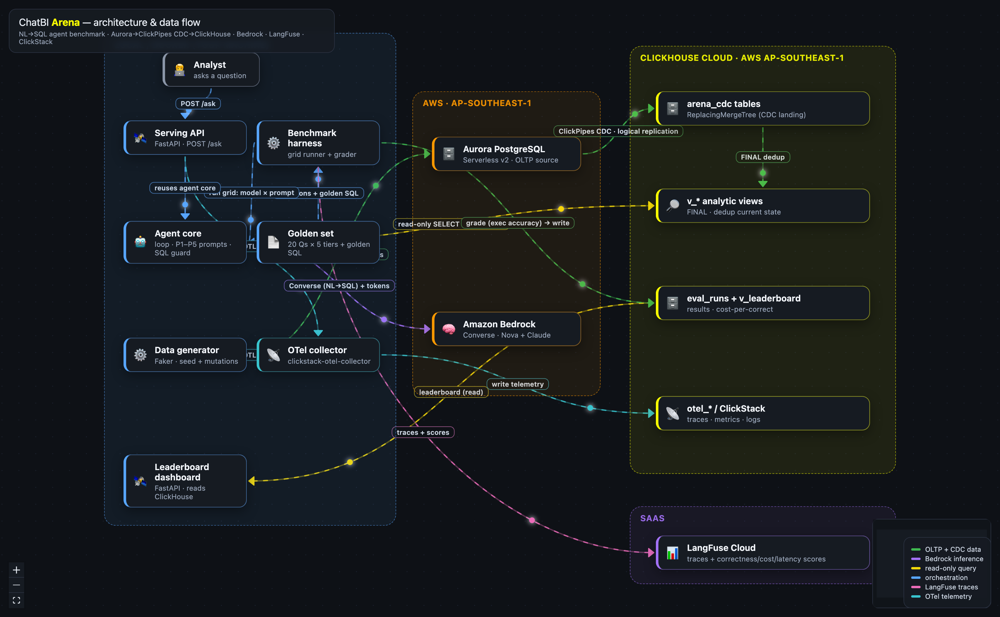

# ChatBI Arena — Architecture Data-Flow Diagram

An animated [React Flow](https://reactflow.dev) (`@xyflow/react`) diagram of the
whole ChatBI Arena architecture. Packets travel along each edge to show the
direction of data flow; colors group the flow types (legend bottom-right).



## Run

```bash
cd diagram
npm install
npm run dev      # → http://localhost:5174   (live, animated)
# or a static build:
npm run build && npm run preview
```

## What it shows (accurate to the implementation)

**Zones** = where each component runs:
- **Local / Docker** — data generator, benchmark harness, agent core (loop · P1–P5 · SQL guard), serving API, leaderboard dashboard, OTel collector, golden set.
- **AWS ap-southeast-1** — Aurora PostgreSQL (OLTP source), Amazon Bedrock (Converse).
- **ClickHouse Cloud (AWS ap-southeast-1)** — `arena_cdc` ReplacingMergeTree tables, `v_*` FINAL views, `eval_runs` + `v_leaderboard`, `otel_*`/ClickStack tables.
- **SaaS** — LangFuse Cloud.

**Edges** (each a labeled, animated flow):
| Flow | Type |
|---|---|
| data generator → Aurora (INSERT + status UPDATEs) | OLTP data |
| Aurora → `arena_cdc` (ClickPipes CDC, logical replication) | data |
| `arena_cdc` → `v_*` views (FINAL dedup) | data |
| agent core → Bedrock (Converse NL→SQL + tokens) | AI inference |
| agent core → `v_*` views (read-only sandboxed SELECT) | read query |
| golden set → harness; harness → agent (grid: model × prompt) | orchestration |
| analyst → serving API (POST /ask); serving → agent (reuses core) | orchestration |
| harness → `eval_runs` (grade by execution accuracy → write) | data |
| harness → LangFuse (traces + scores) | trace |
| `eval_runs`/`v_leaderboard` → dashboard (read) | read query |
| data generator + serving → OTel collector (OTLP) → `otel_*` | telemetry |

## Files
- `src/graph.js` — the architecture model (nodes, zones, edges). Edit here to change the diagram.
- `src/nodes/CardNode.jsx`, `src/nodes/ZoneNode.jsx` — node renderers.
- `src/edges/AnimatedFlowEdge.jsx` — the animated flow edge (moving packet + dashes).
- `src/App.jsx` — React Flow canvas, legend, minimap.
