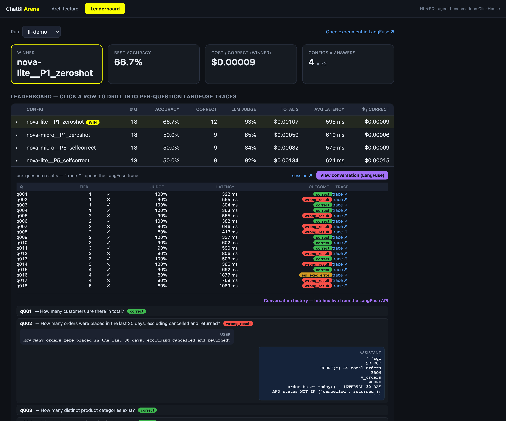

# ChatBI Arena — Web UI (Architecture + Leaderboard)

A single [React](https://react.dev) ([Vite](https://vite.dev)) SPA with two tabs:

- **Architecture** — an animated [React Flow](https://reactflow.dev) (`@xyflow/react`)
  data-flow diagram of the whole system. Packets travel along each edge to show
  flow direction; edge colors group flow types, node colors show where each
  component runs (legend top-right). Edge labels are short so they don't cover the
  arrows — **hover an edge label** to see the full description. Nodes are
  draggable; drag the canvas to pan, scroll to zoom.
- **Leaderboard** — the benchmark results from ClickHouse (`v_leaderboard`),
  with run selector, winner cards, sortable leaderboard, per-tier heatmap, and
  outcome breakdown — plus the **LangFuse-powered** layer:
  - an **LLM-judge** column (a Bedrock-scored SQL-quality dimension, stored as a
    LangFuse score and in `eval_runs`);
  - **click any config row** to drill into its per-question results, each linking
    to its **LangFuse trace** (prompt → SQL → error → span timings → tokens);
  - **“View conversation (LangFuse)”** loads the config's session **live from the
    LangFuse API** and renders the full multi-turn conversation in-app;
  - **session ↗** and **Open experiment in LangFuse ↗** deep-link to LangFuse's
    native session + Dataset/Experiment comparison views.




Diagram layout is computed by **dagre** (layered left→right with crossing
minimization); edges use orthogonal smoothstep routing.

## Run

```bash
cd diagram
npm install
npm run dev            # → http://localhost:5174  (both tabs)
```

The **Leaderboard tab** needs the dashboard API running (the Architecture tab
needs nothing):

```bash
# from the repo root, in another shell:
source .env && uvicorn dashboard.app:app --port 8000
```

The UI calls `http://localhost:8000` by default; override with
`VITE_API_BASE=http://host:8000 npm run dev`. The API has CORS enabled for the SPA.

## Files
- `src/App.jsx` — tab shell (Architecture / Leaderboard).
- `src/api.js` — dashboard API base + fetch helper (`VITE_API_BASE`).
- `src/diagram/graph.js` — architecture model (nodes + edges, env colors). Edit here to change the diagram.
- `src/diagram/layout.js` — dagre layered LR auto-layout.
- `src/diagram/FlowDiagram.jsx` — React Flow canvas + legends + minimap.
- `src/diagram/nodes/CardNode.jsx`, `src/diagram/edges/AnimatedFlowEdge.jsx` — renderers.
- `src/leaderboard/Leaderboard.jsx` — leaderboard UI (fetches the FastAPI API).

> The leaderboard data comes from `dashboard/app.py` (a FastAPI JSON API over
> ClickHouse). This React UI is the only front-end — the old static dashboard
> page was removed.
